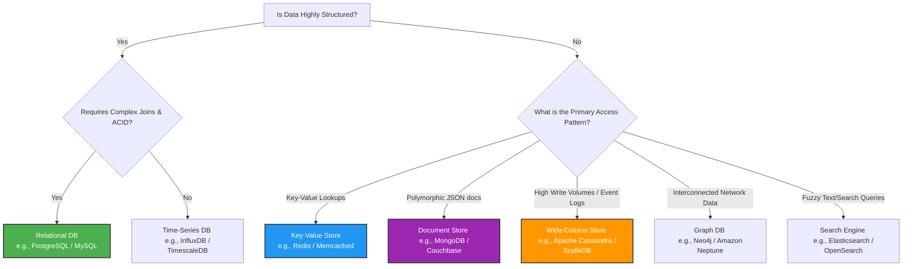

# Database Architecture & Selection Knowledge Base 🗄️📐

Welcome to my System Design and Cloud Architecture knowledge base. This repository serves as an advanced blueprint for understanding **why** specific databases are selected for large-scale enterprise systems. 

As a Solution Architect, the core principle guiding my designs is **Polyglot Persistence**—breaking away from monolithic databases and utilizing the absolute best database tool for each individual microservice workload based on data patterns, scale, and performance requirements.

---

## 🗺️ The Architect's Decision Flowchart

When designing a system component, use this definitive architectural decision tree to determine the optimal database category:



---

## 🗺️ The 5-Step Architect Decision Framework

Before choosing a database, a Solution Architect must evaluate five critical dimensions:
1. **Data Structure:** Is the data highly structured (tabular) or polymorphic/flexible (JSON-like)?
2. **Access Pattern:** Is the workload read-heavy, write-heavy, or centered around complex relationship traversals?
3. **Scalability:** Do we need vertical scaling (SQL replicas) or massive horizontal scaling (NoSQL partitioning)?
4. **Consistency Model:** Do we require strict ACID compliance (Financial ledgers) or is eventual consistency acceptable (Social media feeds)?
5. **Latency Requirements:** Do we need sub-millisecond in-memory speeds or standard millisecond disk reads?

---

## ⚡ The 7 Core Database Patterns Every Architect Must Know

| Pattern | Key Characteristics | Ideal Use Cases | Top Tech Choices |
| :--- | :--- | :--- | :--- |
| **1. Relational (CRUD)** | Structured schema, ACID compliance, complex joins | User accounts, financial ledgers, inventory | PostgreSQL, MySQL |
| **2. Document** | Flexible, evolving schema, hierarchical JSON data | E-commerce product catalogs, CMS, user profiles | MongoDB, Couchbase |
| **3. Key-Value** | Simple lookups, ultra-low latency, high throughput | Caching, session management, rate-limiting | Redis, Memcached |
| **4. Wide Column** | Distributed architecture, optimized for massive writes | Chat history, telemetry logging, activity feeds | Apache Cassandra, ScyllaDB |
| **5. Graph** | Highly interconnected data, complex relationship traversal | Social networks, fraud detection, recommendation engines | Neo4j, Amazon Neptune |
| **6. Time-Series** | Append-only data strictly organized by timestamps | IoT sensor data, DevOps server metrics | InfluxDB, TimescaleDB |
| **7. Search Engine** | Full-text search, inverted indexes, rapid log analytics | Product catalogs search, log aggregation | Elasticsearch, OpenSearch |

---

## 🏢 Real-World Case Studies & Architectures

### 🎬 Case Study: Netflix-Style Streaming Backend
A large-scale streaming system cannot survive on a single database. Here is how multiple data patterns work together seamlessly in a microservices ecosystem:

* **User Authentication Service (`PostgreSQL`):** Requires strict ACID transactions and relational structure to handle billing, user credentials, and subscription states securely.
* **Movie Catalog Service (`MongoDB`):** Movie metadata varies wildly (e.g., Movies have actors/directors; TV Shows have seasons/episodes). A document store handles this flexible schema perfectly.
* **Streaming Session Cache (`Redis`):** Tracks real-time playback states (e.g., `user:123:movie:99 -> 01:10:23`). Loads instantly when a user hits "Resume".
* **User Watch History Service (`Apache Cassandra`):** Generates billions of append-only row writes daily. Cassandra's masterless horizontal scaling easily handles this volume.
* **Search Service (`Elasticsearch`):** Powers the fuzzy, instant search bar as users type out movie names or genres.

### 🚗 Quick Reference Guide for Top Tech Systems
* **Uber-like Ride Tracking:** Drivers push location coordinates every few seconds. Uses **Cassandra** for write-heavy geographic streams.
* **WhatsApp-like Messaging:** Append-only, chronological message logs. Uses **Cassandra** or **RocksDB**.
* **Amazon-like Shopping Cart:** Ephemeral, fast, temporary data. Uses **Redis** with auto-expiring keys.

---
```
architect-db-selection-guide/
├── .github/
│   └── workflows/              # DevSecOps CI Pipelines (Trivy, Terrascan, Helm lint)
├── argocd/                     # --- GITOPS ENGINE LAYER ---
│   ├── bootstrap/              # Automation scripts for cluster startup
│   │   ├── install-basic.sh    # Script for single-node / testing
│   │   └── install-ha.sh       # Script for 3-node production HA
│   ├── system/                 # ArgoCD Self-Management configurations
│   │   ├── argocd-cm.yaml      # Global settings & UI tweaks
│   │   ├── argocd-rbac-cm.yaml # Security RBAC (Least privilege access)
│   │   └── argocd-secret.yaml  # Secret templates (ExternalSecret references)
│   ├── projects/               # Team/Environment governance
│   │   ├── core-infra.yaml     # Restrictive project for backend operators
│   │   └── db-apps.yaml        # Project wrapper for database applications
│   └── apps/                   # Child Applications (Decoupled sync loops)
│       ├── 01-relational-apps.yaml
│       ├── 02-nosql-apps.yaml
│       ├── 03-cache-apps.yaml
│       └── 04-vector-graph-apps.yaml
├── databases/                  # --- THE SINGLE SOURCE OF TRUTH (SSoT) ---
│   ├── 01-relational/          # ACID, Structured Data
│   │   ├── postgresql/         # CloudNativePG Operator / Helm config
│   │   └── mysql-galera/       # StatefulSets for HA Mysql
│   ├── 02-nosql/               # Document, Key-Value, Wide-Column
│   │   ├── mongodb/            # Document engine definitions
│   │   └── cassandra-scylla/   # Distributed masterless topology
│   ├── 03-in-memory-cache/     # Speed & Transient states
│   │   ├── redis-cluster/      # High-availability caching tier
│   │   └── memcached/          # Simple volatile lookups
│   ├── 04-vector-ai/           # RAG, LLM context embeddings (Crucial for 2026 architectures)
│   │   ├── milvus/             # Cloud-native vector processing 
│   │   └── qdrant/             # Rust-based high performance vector search
│   └── 05-graph/               # Relational entity mapping
│       └── neo4j/              # Cypher-query graph clusters
├── root-app.yaml               # The "App-of-Apps" ultimate bootstrap entrypoint
├── docs/                       # Architectural Selection Guides & Matrixes
│   └── selection-matrix.md     # Comparison of CAP theorem choices per DB engine
└── README.md                   # Main Project Hub & Portfolio Dashboard
```
## 🚀 Practical Implementations & Demos
*(Note: Use this section to link to your own code folders inside this repository as you build them!)*

* 📂 `/demos/fastapi-mongodb-catalog` - A Python FastAPI product catalog demonstrating dynamic schema insertion.
* 📂 `/demos/redis-session-manager` - A quick guide on setting up token caching and session expiration.

---
*Deepen your architecture mindset. Never ask "Which database should we use?" Instead ask "What is the data pattern?"*
### 1. First Understand: Why Non-Relational Databases Exist

Traditional relational databases like MySQL or PostgreSQL store data in fixed tables with strict schema.

But modern systems like:
```
Netflix
Amazon
Uber
Social media apps
```
have huge, flexible, and rapidly changing data.

So they use NoSQL databases such as:
```
MongoDB
Apache Cassandra
Redis
Amazon DynamoDB
Azure Cosmos DB
```
### 2. Types of NoSQL Databases (Architect View)
| Type | Example | Use Case |
| :--- | :--- | :--- |
| **Document** | MongoDB | User profiles, catalogs |
| **Key-Value** | Redis | Caching, sessions |
| **Column** | Cassandra | Massive scale logging |
| **Graph** | Neo4j | Social networks |
### 3. Real Project Demo (Architect Scenario)
Project: E-commerce Product Catalog
Imagine you are designing an Amazon-like product system.
Each product has different attributes:
```
Example:

Laptop

brand
ram
processor
battery
screen_size

Shoes

brand
size
material
color
```
If you use relational DB:
```
Products Table
--------------
id
name
brand
ram
processor
battery
screen_size
size
material
color
```
Most columns will be NULL.

Bad design.

### 4. Why MongoDB is Perfect Here

Using MongoDB, each product is a document.
```
Example:

Laptop Document
{
 "name": "MacBook Pro",
 "brand": "Apple",
 "ram": "16GB",
 "processor": "M3",
 "battery": "18h"
}
Shoes Document
{
 "name": "Nike Air",
 "brand": "Nike",
 "size": 9,
 "color": "black",
 "material": "mesh"
}
```
Different structure — no problem.

### 5. Practical Project (You Can Run This)

We will build:
```
Product API
      |
      v
FastAPI (Python)
      |
      v
MongoDB
```
### 6. Install MongoDB (Local)

Install from:

MongoDB Official Download

Or run using Docker:
```
docker run -d -p 27017:27017 mongo
```
### 7. Create Project

Install dependencies:
```
sudo pip install fastapi uvicorn pymongo
```
### 8. Python API Code
```
from fastapi import FastAPI
from pymongo import MongoClient

app = FastAPI()

client = MongoClient("mongodb://localhost:27017/")
db = client["ecommerce"]
products = db["products"]

@app.post("/product")
def add_product(product: dict):
    products.insert_one(product)
    return {"message": "Product added"}

@app.get("/products")
def get_products():
    data = list(products.find({}, {"_id":0}))
    return data
```
### 9. Run Server
```
uvicorn main:app --reload
```
Open:
```
http://127.0.0.1:8000/docs
```
Now you can insert products with different structures.

### 10. Architect Decision Matrix

An architect decides DB like this:

Requirement	DB Choice
Structured financial data	SQL
flexible schema	MongoDB
ultra-high write scale	Cassandra
caching	Redis
relationships (social graph)	Neo4j
11. Real Architecture Used in Companies

Example microservice architecture:

User Service → PostgreSQL
Product Service → MongoDB
Session Service → Redis
Analytics → Cassandra

Each service uses the best database for its job.

This concept is called:

Polyglot Persistence

12. Best Online Project (Real Demo)

You should explore this real example project:

MongoDB FastAPI Example Project

It shows:

API
MongoDB
CRUD
real backend architecture
13. Architect Level Understanding

When architects choose a database they evaluate:

1️⃣ Data structure
2️⃣ Query pattern
3️⃣ Scalability needs
4️⃣ Consistency model
5️⃣ Latency requirement

14. The Database Knowledge Every Architect Must Have

Must understand at least these systems:

Relational

PostgreSQL
MySQL

NoSQL

MongoDB
Apache Cassandra
Redis

Cloud

Amazon DynamoDB
Azure Cosmos DB
15. Architect Learning Path (Recommended)

Step 1
Understand data modeling

Step 2
Build MongoDB project

Step 3
Build Redis caching system

Step 4
Design distributed database architecture

Step 5
Study CAP theorem

✅ If you want, I can also show you a complete Architect-level project:

"Design Netflix-style streaming backend using multiple databases"

Where we use:

MongoDB
Redis
Cassandra
PostgreSQL

This project will dramatically improve your architecture thinking.
