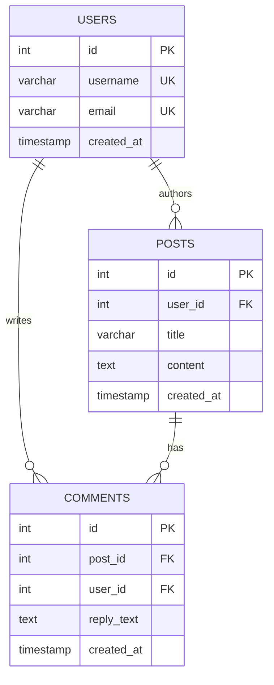

### Building a Multi-User Blogging or Forum Platform (like a mini Reddit or Medium).

You will use PostgreSQL (the industry-standard relational database) running inside Docker, just like your previous setup.
#### Core Architecture Components you'll learn:
- Strict Schemas & Data Types: You must explicitly define your tables (users, posts, comments) and their column types (INT, VARCHAR, TIMESTAMP) before writing any data.
- Foreign Keys & Relationships: You'll enforce integrity so a post cannot exist without a valid user_id (One-to-Many), and implement a join table for something like post tags (Many-to-Many).
- SQL JOIN Queries: Instead of nesting everything in one big document (like MongoDB), you'll write structured queries using INNER JOIN or LEFT JOIN to stitch your data back together on the fly.


   #### 🛠️ Step 1: Prepare Your Workspace
Since you are already in your terminal, let's step into the correct directory for this project:


 Move out of the in-memory cache directory and into the relational folder
cd ../01-relational

#### 📦 Step 2: Create Your Stack Files
Let's set up the infrastructure first using Docker.

1. Create a docker-compose.yml file:
Run nano docker-compose.yml and paste this block:

```
version: '3.8'

services:
  postgres:
    image: postgres:16-alpine
    container_name: postgres_db
    environment:
      POSTGRES_USER: admin
      POSTGRES_PASSWORD: supersecretpassword
      POSTGRES_DB: forum_db
    ports:
      - "5432:5432"
    volumes:
      - pg_data:/var/lib/postgresql/data

volumes:
  pg_data:
```
#### 2. Create your Node.js configuration:
Run npm init -y to create your base package file, then open it (nano package.json) and make sure it includes the "type": "module" configuration so you can use modern ES imports:
```
{
  "name": "relational-postgres",
  "version": "1.0.0",
  "type": "module",
  "main": "server.js",
  "scripts": {
    "dev": "nodemon server.js"
  }
}
```
#### 3. Install the application drivers:
For PostgreSQL in Node.js, the most popular raw driver is pg. Run this command to install your tools:
```
npm install express pg dotenv && npm install --save-dev nodemon
```
#### Ready to Build?
Now that the blueprint is locked down, let's write the initialization script to tell PostgreSQL to spin these up.

Create a file named schema.sql in your directory:

```
nano schema.sql
```
Paste the SQL definitions directly into it:
```
-- Create Users Table
CREATE TABLE users (
    id SERIAL PRIMARY KEY,
    username VARCHAR(50) UNIQUE NOT NULL,
    email VARCHAR(100) UNIQUE NOT NULL,
    created_at TIMESTAMP DEFAULT CURRENT_TIMESTAMP
);

-- Create Posts Table (One-to-Many: One user can have many posts)
CREATE TABLE posts (
    id SERIAL PRIMARY KEY,
    user_id INT REFERENCES users(id) ON DELETE CASCADE,
    title VARCHAR(255) NOT NULL,
    content TEXT NOT NULL,
    created_at TIMESTAMP DEFAULT CURRENT_TIMESTAMP
);

-- Create Comments Table (One-to-Many: One post can have many comments)
CREATE TABLE comments (
    id SERIAL PRIMARY KEY,
    post_id INT REFERENCES posts(id) ON DELETE CASCADE,
    user_id INT REFERENCES users(id) ON DELETE CASCADE,
    reply_text TEXT NOT NULL,
    created_at TIMESTAMP DEFAULT CURRENT_TIMESTAMP
);
```
Step 3: Spin Up PostgreSQL and Load the Schema
Now that the structural blueprint is ready, let's boot up the engine and pipe the schema.sql rules directly into your running database.

Launch the PostgreSQL container in the background:

```
docker compose up -d
```
Execute your SQL schema file inside the running container:

```
docker exec -i postgres_db psql -U admin -d forum_db < schema.sql
```
##### 💡 What this does: It reads your local schema.sql file and streams it straight into the psql command-line tool inside Docker, building out your tables instantly.
##### Step 4: Create the Database Connection Bridge (db.js)
Unlike MongoDB/Mongoose which handles connections implicitly, PostgreSQL uses a Connection Pool (Pool). A pool keeps a collection of open connections ready, making your app incredibly fast because it doesn't open and close a socket connection for every single HTTP request.

Create your connection file:
```
nano db.js
```
Paste this configuration code inside:
```
import pkg from 'pg';
const { Pool } = pkg;

// Create a pool instance using your Docker configuration details
const pool = new Pool({
    user: 'admin',
    host: 'localhost',
    database: 'forum_db',
    password: 'supersecretpassword',
    port: 5432,
});

// Helper function to execute queries and handle connection logs
export const query = (text, params) => pool.query(text, params);

export const connectDB = async () => {
    try {
        // Test out the pool connection connection
        const res = await query('SELECT NOW()');
        console.log('🐘 PostgreSQL Connected Successfully at:', res.rows[0].now);
    } catch (err) {
        console.error('❌ Database connection failed:', err.message);
        process.exit(1);
    }
};
```
database layer is officially established, the schemas are applied, and your Node-to-Postgres connection bridge is ready to handle queries.
##### build the Express application routing so you can see how relational data is created and linked together using SQL commands. We will build two crucial paths: one to create a user, and one to create a post linked to that user.
#### Step 5: Build the Express API Endpoints
Create a routes file to handle our relational inputs:
```
nano routes.js
```
Paste this code block into the file. Pay close attention to the INSERT statements—this is how raw SQL handles incoming variables safely using placeholders ($1, $2):
```
import express from 'express';
import { query } from './db.js';

const router = express.Router();

// 1. Create a New User
router.post('/users', async (req, res) => {
    const { username, email } = req.body;
    try {
        const sql = `
            INSERT INTO users (username, email) 
            VALUES ($1, $2) 
            RETURNING *;
        `;
        const result = await query(sql, [username, email]);
        res.status(201).json(result.rows[0]);
    } catch (err) {
        res.status(500).json({ error: err.message });
    }
});

// 2. Create a Post (Linked to a User via Foreign Key)
router.post('/posts', async (req, res) => {
    const { user_id, title, content } = req.body;
    try {
        const sql = `
            INSERT INTO posts (user_id, title, content) 
            VALUES ($1, $2, $3) 
            RETURNING *;
        `;
        const result = await query(sql, [user_id, title, content]);
        res.status(201).json(result.rows[0]);
    } catch (err) {
        res.status(500).json({ error: err.message });
    }
});

export default router;
```
#### Step 6: Assemble the Main Server File
Now, let's tie your connection logic and your routes together into a standard execution entry point.

Create your main execution file:
```
nano server.js
```
Paste this code block inside:
```
import express from 'express';
import { connectDB } from './db.js';
import router from './routes.js';

const app = express();
app.use(express.json());

// Mount the forum router
app.use('/api', router);

const PORT = process.env.PORT || 3000;

// Connect to PostgreSQL first, then start listening
connectDB().then(() => {
    app.listen(PORT, () => {
        console.log(`🚀 Relational API Server running on port ${PORT}`);
    });
});
```

#### Step 7: Fire Up the Server Engine
Everything is locked and loaded. Execute your development script to boot your PostgreSQL application stack:
```
npm run dev
```
💡 What you should see: > 🐘 PostgreSQL Connected Successfully at: [Current Timestamp]

🚀 Relational API Server running on port 3000


Now let's see relational data integrity in action. Open a second terminal window or use curl to run these steps to populate the database and test how the records link together.

##### Step 1: Create a User
Run this command to create your first author record.
```
curl -X POST http://localhost:3000/api/users \
-H "Content-Type: application/json" \
-d '{"username": "dev_architect", "email": "architect@example.com"}'
```
📊 Expected Output: You'll receive a JSON response showing the saved user record. Notice that PostgreSQL automatically generated an id: 1 for this user.


##### Step 2: Create a Relational Post (Using the Foreign Key)
Now, create a post that links directly back to that user by passing their generated ID into the user_id field:
```
curl -X POST http://localhost:3000/api/posts \
-H "Content-Type: application/json" \
-d '{"user_id": 1, "title": "Mastering Postgres Constraints", "content": "Relational integrity ensures consistency across our tables."}'
```
📊 Expected Output: A success response showing the new post row linked directly to user 1.

##### Step 3: Test the SQL Relational Guardrails (The Fun Part)
To truly understand why relational systems are bulletproof, try to intentionally break the system by creating a post for a user that does not exist (e.g., user_id: 999):
```
curl -X POST http://localhost:3000/api/posts \
-H "Content-Type: application/json" \
-d '{"user_id": 999, "title": "Ghost Post", "content": "This shouldn'\''t work."}'
```
🚫 Expected Error Output:
```
{
  "error": "insert or update on table \"posts\" violates foreign key constraint \"posts_user_id_fkey\""
}
```
Why this is amazing: In MongoDB, you could accidentally insert a broken reference string and the database wouldn't care. PostgreSQL refuses to save bad data, acting as a structural firewall for your application logic!

##### Step 4: The Next Evolution — Reading Data with a JOIN
Right now, you can write data, but how do we read a post and automatically pull the author's username at the same time?

In MongoDB, you'd have to make two separate database trips or run a heavy aggregation pipeline. In SQL, we stitch them together instantly using a JOIN query.

Let's add a GET endpoint to see how this works. Open your routes.js file (nano routes.js) and append this new route right before the export default router; line at the bottom:
```
// 3. Get All Posts with Author Metadata (SQL INNER JOIN)
router.get('/posts', async (req, res) => {
    try {
        const sql = `
            SELECT posts.id, posts.title, posts.content, posts.created_at, users.username, users.email
            FROM posts
            INNER JOIN users ON posts.user_id = users.id;
        `;
        const result = await query(sql);
        res.json(result.rows);
    } catch (err) {
        res.status(500).json({ error: err.message });
    }
});
```
Save the file, let nodemon auto-restart your server, and then execute a quick fetch command in your terminal:
```
curl http://localhost:3000/api/posts
```
You'll get a beautifully unified dataset combining information from both tables on the fly
#### Cascading Deletes in Action
In a relational system, data has clear ownership. Because a post cannot exist without an author, what happens if that author deletes their account?

When we created the posts table in your schema.sql, we added a rule called ON DELETE CASCADE:\
```
user_id INT REFERENCES users(id) ON DELETE CASCADE
```
This tells PostgreSQL: "If a user row is deleted, automatically find all post rows linked to their id and wipe them out too." This keeps our database clean and prevents "orphan" rows.

Let's build a route to test this. Open routes.js one more time:
```
nano routes.js
```
Append this deletion route at the bottom, just above export default router;:
```
// 4. Delete a User (Triggers Cascading Delete on their Posts)
router.delete('/users/:id', async (req, res) => {
    const { id } = req.body; // or req.params.id
    try {
        const sql = `DELETE FROM users WHERE id = $1 RETURNING *;`;
        const result = await query(sql, [req.params.id]);
        
        if (result.rows.length === 0) {
            return res.status(404).json({ message: "User not found" });
        }
        
        res.json({ 
            message: "User and all their associated posts deleted successfully!",
            deletedUser: result.rows[0]
        });
    } catch (err) {
        res.status(500).json({ error: err.message });
    }
});
```
The Final Test Run
Let's execute a DELETE request to watch the cascade happen in real-time.

1. Delete User 1:
```
curl -X DELETE http://localhost:3000/api/users/1
```
📊 Response: You'll see confirmation that dev_architect has been deleted.

2. Verify that their posts were completely destroyed as well:
```
curl http://localhost:3000/api/posts
```
📊 Response: [] (An empty array!).

Even though we never explicitly deleted the post, PostgreSQL reached into the posts table and scrubbed it from the disk automatically to preserve strict structural integrity.

🏁 Relational Milestone Reached!
You have officially built, connected, and broken a relational database engine. You now understand:

How strict schemas prevent bad data formats.

How foreign keys link records logically.

How JOIN statements pull related sets on demand.

How CASCADE operations maintain systemic hygiene.

Useful SQL Commands to Experiment With:

Filter Data (WHERE): Fetching posts from a specific user.
```
SELECT * FROM posts WHERE user_id = 1;
```
Count Records (COUNT & GROUP BY): Finding out how many posts each user has written.
```
SELECT user_id, COUNT(id) AS total_posts 
FROM posts 
GROUP BY user_id;
```
Partial Matching (LIKE): Searching for posts where the title contains a specific word.
```
SELECT * FROM posts WHERE title LIKE '%Postgres%';
```
