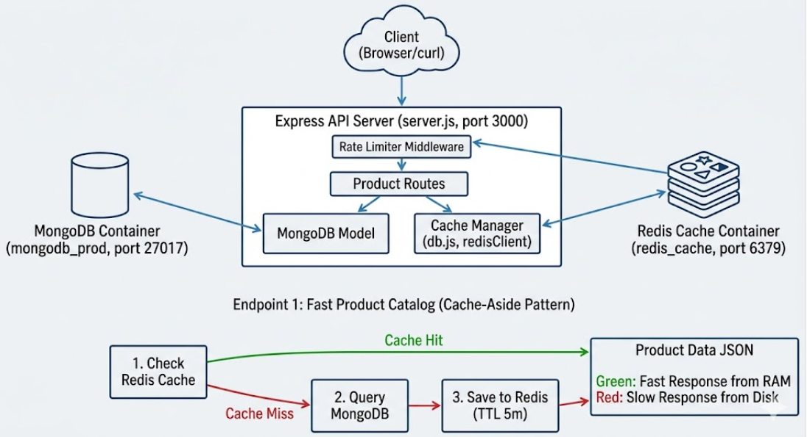

### What is Redis?
Redis (Remote Dictionary Server) is an open-source, in-memory data structure store. Unlike traditional databases (like PostgreSQL or MongoDB) that primarily write data to a physical disk, Redis keeps all its data in the server's RAM.

Because reading and writing to memory is exponentially faster than reading from a disk, Redis delivers sub-millisecond response times, making it incredibly popular for high-throughput applications.

#### Core Characteristics:
- In-Memory but Persistent: While data lives in RAM for speed, Redis can periodically snapshot data to disk or write it to a log so it isn't lost if the server reboots.
- Data Structures (Not just Strings): It isn't just a simple key-value store. It supports native data structures like Strings, Lists, Sets, Hashes, and Sorted Sets.
- Single-Threaded Core: Redis handles commands sequentially using a single-threaded event loop. This prevents race conditions and makes operations extremely predictable and atomic without complex locking mechanisms.

#### Real-World Architectural Patterns
- 1.In production systems, Redis is rarely used as the primary permanent database. Instead, it usually operates alongside a database like MongoDB or PostgreSQL using these core patterns:
- 2.Cache-Aside Pattern: The application looks for data in Redis first. If it's a Cache Hit, it returns the data instantly. If it's a Cache Miss, the app queries MongoDB, returns the data to the user, and saves a copy in Redis with an Expiration Time (TTL) for next time.
- 3.Session Store: Storing user login sessions in Redis so that if your backend application scales to 5 different servers, they can all quickly check Redis to see if a user is logged in.
- 4.Rate Limiter: Using atomic counters to block a user or API key if they make too many requests within a minute (e.g., protecting against DDoS or brute-force attacks).

 #### The Project : E-Commerce Product Catalog with Smart Caching & Rate Limiting
To simulate a real production architecture, we will build a project that bridges your previous MongoDB work with Redis.
```
[Client Request] 
       │
       ▼
 [Rate Limiter (Redis)] ───► (Block if requests > threshold)
       │
       ▼
 [Cache Check (Redis)] ────► [Cache Hit] ───► Return Fast Product Data
       │
   [Cache Miss]
       │
       ▼
 [Database (MongoDB)] ─────► Fetch Data ───► Save to Redis (TTL) ───► Return Data
```
#### Key Components of the Project:
- Endpoint 1: Fast Product Catalog (Cache-Aside)
   1. We will fetch a heavy product detail page.
   2. First Request (Cache Miss): Fetches from MongoDB (simulating a slow, disk-bound query). The system writes the result to Redis with a 5-minute Time-To-Live (TTL).
   3. Subsequent Requests (Cache Hit): Fetches directly from Redis instantly, bypassing MongoDB entirely.
- Endpoint 2: API Rate Limiter
  1. We will implement an IP-based or User-based API rate limiter.
  2. Using Redis strings and counters, we will restrict a user to a maximum of 10 API requests per minute. If they exceed it, Redis flags it, and the app throws a 429 Too Many Requests error.

- Endpoint 3: Active Session Manager
  We will store simulated user login tokens in Redis hashes to demonstrate how stateless microservices validate active user sessions in real-time.

#### What You Will Learn
- How to configure connection pools for both MongoDB and Redis simultaneously.
- How to handle serialization (converting database objects to JSON strings for Redis) and deserialization.
- How to manage cache invalidation (updating or deleting cache when product details change in MongoDB so users don't see stale data).


  #### We will use Node.js with Express, the official redis client, and mongoose for MongoDB.

##### Folder Structure
Create this file inside your Node.js project folder structure like this:
```
project/
│
├── middleware/
│   └── rateLimiter.js
│
├── routes/
│   └── productRoutes.js
│
├── models/
│   └── Product.js
│
├── db.js
├── server.js
├── .env
└── package.json
```
Create a .env file in the root of your directory to hold your connection strings:
```
PORT=3000
MONGO_URI=mongodb://localhost:27017/ecommerce
REDIS_URL=redis://localhost:6379
```
##### Step 2: Database Connection Pool Setup
Create a db.js file. We want to establish connections to both databases concurrently when the application boots up.
```
// db.js
import mongoose from 'mongoose';
import { createClient } from 'redis';
import dotenv from 'dotenv';

dotenv.config();

// 1. Initialize Redis Client
const redisClient = createClient({
    url: process.env.REDIS_URL
});

redisClient.on('error', (err) => console.error('Redis Client Error', err));

export const connectDBs = async () => {
    try {
        // Connect to MongoDB
        await mongoose.connect(process.env.MONGO_URI);
        console.log('🔹 MongoDB Connected Successfully');

        // Connect to Redis
        await redisClient.connect();
        console.log('🔸 Redis Connected Successfully');
    } catch (error) {
        console.error('❌ Database connection failed:', error);
        process.exit(1);
    }
};

export { redisClient };
```
#####  Step 3: Define the MongoDB Product Schema
Create a basic model for your product inventory.
```
// models/Product.js
import mongoose from 'mongoose';

const productSchema = new mongoose.Schema({
    name: { type: String, required: true },
    description: String,
    price: { type: Number, required: true },
    stock: { type: Number, required: true },
}, { timestamps: true });

export const Product = mongoose.model('Product', productSchema);
```

##### Step 4: Component Implementation
1. The Rate Limiter Middleware
This custom middleware leverages Redis to increment an IP address counter. If the counter exceeds 10 requests within a window of 60 seconds, it blocks the client.
```
// middleware/rateLimiter.js
import { redisClient } from '../db.js';

export const rateLimiter = async (req, res, next) => {
    const ip = req.ip;
    const key = `rate:${ip}`;
    
    try {
        // Increment the request count for this IP
        const requests = await redisClient.incr(key);
        
        // If it's a new or expired bucket, set the TTL to 60 seconds
        if (requests === 1) {
            await redisClient.expire(key, 60);
        }
        
        // Block if limit exceeded
        if (requests > 10) {
            return res.status(429).json({
                error: 'Too Many Requests',
                message: 'You have exceeded the limit of 10 requests per minute.'
            });
        }
        
        next();
    } catch (error) {
        console.error('Rate limiter error:', error);
        next(); // Fail-open in production, or handle gracefully
    }
};
```
2. The Cache-Aside Endpoint
Here, we try reading from Redis first. On a miss, we fall back to Mongo, then store the result stringified inside Redis with an expiration window.
```
// routes/productRoutes.js
import { Router } from 'express';
import { Product } from '../models/Product.js';
import { redisClient } from '../db.js';

const router = Router();

router.get('/products/:id', async (req, res) => {
    const { id } = req.params;
    const cacheKey = `product:${id}`;

    try {
        // 1. Check Redis Cache
        const cachedProduct = await redisClient.get(cacheKey);
        
        if (cachedProduct) {
            return res.json({
                source: 'Redis Cache (Cache Hit)',
                data: JSON.parse(cachedProduct)
            });
        }

        // 2. Cache Miss - Query MongoDB
        const product = await Product.findById(id);
        if (!product) {
            return res.status(404).json({ message: 'Product not found' });
        }

        // 3. Populate Redis with a 5-minute (300 seconds) Time-To-Live
        await redisClient.setEx(cacheKey, 300, JSON.stringify(product));

        return res.json({
            source: 'MongoDB (Cache Miss)',
            data: product
        });
    } catch (error) {
        return res.status(500).json({ error: error.message });
    }
});

export default router;
```
##### Step 5: Tying It All Together (server.js)
Assemble the application entry point:
```
// server.js
import express from 'express';
import { connectDBs } from './db.js';
import { rateLimiter } from './middleware/rateLimiter.js';
import productRouter from './routes/productRoutes.js';

const app = express();
app.use(express.json());

// Apply Rate Limiter globally to all API paths
app.use('/api', rateLimiter);

// Mount routes
app.use('/api', productRouter);

const PORT = process.env.PORT || 3000;

connectDBs().then(() => {
    app.listen(PORT, () => {
        console.log(`🚀 Server running on port ${PORT}`);
    });
});
```
##### Startup applications
Need to start the backend application server first so it can listen for those requests, and you also need to make sure your background databases (MongoDB and Redis) are actively running on your machine.

Here is the exact sequence to get everything running and verified:

##### Step 1: Start your Databases
Before launching the code, both database engines must be running in the background. Open a terminal and start them (or ensure they are running if you use Docker/services):
#### Setup Docker

Step 1: Install Docker
Open a clean terminal window and run these commands to update your packages and install Docker:
```
# 1. Update your local package index
sudo apt update

# 2. Install necessary prerequisite packages
sudo apt install -y apt-transport-https ca-certificates curl software-properties-common

# 3. Add Docker’s official GPG key
curl -fsSL https://download.docker.com/linux/ubuntu/gpg | sudo gpg --dearmor -o /usr/share/keyrings/docker-archive-keyring.gpg

# 4. Set up the stable Docker repository
echo "deb [arch=$(dpkg --print-architecture) signed-by=/usr/share/keyrings/docker-archive-keyring.gpg] https://download.docker.com/linux/ubuntu $(lsb_release -cs) stable" | sudo tee /etc/apt/sources.list.d/docker.list > /dev/null

# 5. Update packages again and install Docker Engine
sudo apt update
sudo apt install -y docker-ce docker-ce-cli containerd.io
```
Step 2: Manage Docker as a Non-Root User (Convenience Step)
By default, running docker commands requires sudo. To fix this so you can just type docker compose up without entering your password every time, run:
```
# 1. Create the docker group (it might already exist)
sudo groupadd docker

# 2. Add your current user to the docker group
sudo usermod -aG docker $USER
```
Step 3: Verify the Installation
To make sure Docker is working correctly, run the hello-world image:
```
docker run hello-world
```
Step 4: Run your Project Databases
Now you are completely ready to use Docker Compose!

Create that docker-compose.yml file we discussed in the root of your 03-in-memory-cache directory.

Open your terminal in that directory and spin up your databases:
##### Setup Node.js
```
### Step 1: Install Modern Node.js Engine (v20+)
Ensure you have the correct Node.js runtime to support modern syntax engines:
```bash
curl -fsSL [https://deb.nodesource.com/setup_20.x](https://deb.nodesource.com/setup_20.x) | sudo -E bash -
sudo apt remove --purge -y libnode-dev && sudo apt --fix-broken install -y
sudo apt install -y nodejs
  npm -v
```

##### Setup redis and mongodb
Step 2: Create a docker-compose.yml File
In the root of your 03-in-memory-cache directory, create a new file named docker-compose.yml and add the following configuration:
```
version: '3.8'

services:
  redis:
    image: redis:7-alpine
    container_name: redis_cache
    ports:
      - "6379:6379"
    volumes:
      - redis_data:/data

  mongodb:
    image: mongo:7.0
    container_name: mongodb_prod
    ports:
      - "27017:27017"
    volumes:
      - mongo_data:/data/db

volumes:
  redis_data:
  mongo_data:
```
Step 2: Spin Up Both Databases
Instead of running separate terminal setup steps for each database, open a single terminal window and run:
```
docker compose up -d
```

##### Step 3: Project Initialization & Dependencies
Initialize your Node.js environment and install the required application drivers:
```
npm init -y
npm install express mongoose redis dotenv
npm install --save-dev nodemon
```
##### Step 2: Run Your Application Code
Open a terminal inside your 03-in-memory-cache project directory where your server.js and package.json live, and start your Node.js application:
```
# Using nodemon (if configured in package.json scripts)
npm run dev

# Or run it directly with Node
node server.js
```

You should see these success messages in your terminal terminal console:

🔹 MongoDB Connected Successfully
🔸 Redis Connected Successfully
🚀 Server running on port 3000
##### Step 6: Testing the Architecture
Step 3: Run the Verification Steps
Now that the application is alive, follow the verification workflow using a tool like Postman, Bruno, or curl in a separate terminal window:

1. Seed Data (Get a Valid ID)
Since our endpoint expects a MongoDB _id, you need at least one product in your database. You can quickly insert a document using MongoDB Compass or the Mongo Shell (mongosh):
```
use ecommerce;
db.products.insertOne({
  name: "Wireless Mouse",
  description: "Ergonomic 2.4GHz mouse",
  price: 29.99,
  stock: 100
});
```
Copy the generated _id string from that inserted document (e.g., 65f1a2b3c4d5e6f7a8b9c0d1).

2. Execute First Request (Cache Miss)
Send a GET request to your server using the copied ID:
```
curl http://localhost:3000/api/products/YOUR_COPIED_ID
```
- Expected Response: You will see the product JSON data, and the payload will include "source": "MongoDB (Cache Miss)".

- What happened behind the scenes: The app checked Redis, found nothing, read it from MongoDB, and saved it to Redis.

3. Execute Second Request (Cache Hit)
Fire the exact same request immediately:
```
curl http://localhost:3000/api/products/YOUR_COPIED_ID
```
- Expected Response: The data returns instantly, but this time it includes "source": "Redis Cache (Cache Hit)".

- What happened behind the scenes: The app found the data in Redis RAM and completely skipped querying MongoDB.

4. Test the Rate Limiter
Spam that same terminal command or press "Send" in Postman rapidly more than 10 times within one minute.

Expected Response: On the 11th request, the server will block you and return a 429 Too Many Requests status code with your custom error message.

